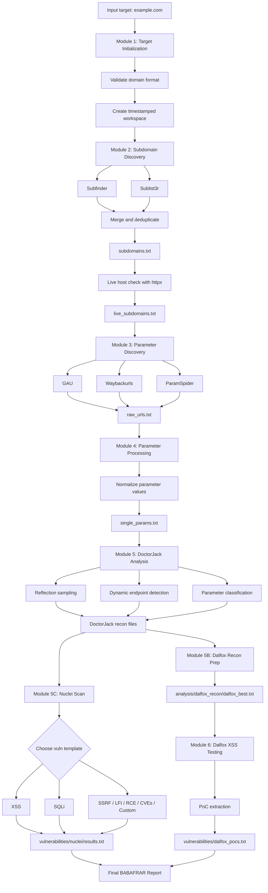
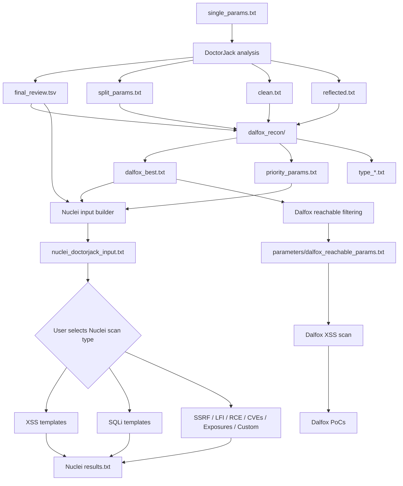

# BABAFRAR

> Automated recon, parameter discovery, DoctorJack prioritization, Nuclei template scanning, and Dalfox-based XSS testing framework for authorized security assessments.


---

## Responsible Use

BABAFRAR is intended only for ethical hacking, bug bounty programs, internal security testing, and authorized penetration testing. Do not scan domains, systems, or applications without explicit permission. You are responsible for following all laws, program rules, and rate limits.

---

## Overview

BABAFRAR is a Bash-based hunting framework that automates the full recon-to-testing workflow:

1. Target validation and workspace creation
2. Subdomain discovery
3. Historical URL and parameter collection
4. Parameter normalization and deduplication
5. DoctorJack parameter analysis and prioritization
6. Dalfox recon file preparation from DoctorJack output
7. Nuclei scanning with user-selected vulnerability templates
8. Dalfox-based XSS testing
9. Final report generation

The framework is designed to reduce noisy URL collections into focused testing lists. DoctorJack produces the main recon files, Nuclei scans those URLs with the selected template family, and Dalfox runs after that for XSS-focused testing and PoC extraction.

---

## Main Workflow



---

## Module Flow

```mermaid
flowchart LR
    M1[1. Target Initialization] --> M2[2. Subdomain Discovery]
    M2 --> M3[3. Parameter Discovery]
    M3 --> M4[4. Parameter Processing]
    M4 --> M5[5. DoctorJack Analysis]
    M5 --> M5B[5B. Dalfox Recon Prep]
    M5B --> M5C[5C. Nuclei Template Scan]
    M5C --> M6[6. Dalfox XSS Testing]
    M6 --> R[Final Report]
```



---

## DoctorJack To Nuclei And Dalfox Flow



---

## Features

- Domain validation before scan execution
- Timestamped result workspaces
- Subdomain discovery with Subfinder and Sublist3r
- Live host filtering with httpx
- Historical URL collection using GAU and Waybackurls
- ParamSpider integration for parameter discovery
- Parameter normalization with qsreplace fallback support
- Parameter frequency analysis
- DoctorJack classification for high-value parameters
- Dalfox recon preparation with `analysis/dalfox_recon/dalfox_best.txt`
- Nuclei scanning with selectable vulnerability template categories
- Nuclei support for XSS, SQLi, SSRF, LFI, RCE, Open Redirect, CVEs, Exposures, and custom templates
- Dalfox file, pipe, and targeted scan modes
- Dalfox PoC block extraction
- Final human-readable report
- Run statistics stored in logs

---

## Toolchain

BABAFRAR uses the following tools:

| Tool | Purpose |
|---|---|
| Subfinder | Passive subdomain discovery |
| Sublist3r | Subdomain discovery |
| httpx | Live host and reachable URL filtering |
| GAU | Historical URL discovery |
| Waybackurls | Archive URL discovery |
| ParamSpider | Parameter discovery from historical sources |
| qsreplace | Parameter value normalization |
| Nuclei | Template-based vulnerability scanning |
| Dalfox | XSS scanning and PoC generation |

---

## Installation

### 1. Clone the repository

```bash
git clone https://github.com/mohithakur0602/Babafrar.git
cd Babafrar
```

### 2. Make the script executable

```bash
chmod +x babafrar.sh
```

### 3. Run a scan

```bash
./babafrar.sh example.com
```

BABAFRAR can attempt to install missing tools automatically when prompted.

---

## Recommended Manual Dependency Installation

For Kali Linux or Debian-based systems:

```bash
sudo apt update
sudo apt install -y git curl wget python3 python3-pip golang-go
```

Install Go-based tools:

```bash
go install github.com/projectdiscovery/subfinder/v2/cmd/subfinder@latest
go install github.com/projectdiscovery/httpx/cmd/httpx@latest
go install github.com/projectdiscovery/nuclei/v3/cmd/nuclei@latest
go install github.com/tomnomnom/anew@latest
go install github.com/tomnomnom/qsreplace@latest
go install github.com/hahwul/dalfox/v2@latest
go install github.com/lc/gau/v2/cmd/gau@latest
go install github.com/tomnomnom/waybackurls@latest
```

Install or update Nuclei templates:

```bash
nuclei -update-templates
```

The script defaults to:

```bash
/usr/share/nuclei-templates
```

If your templates are somewhere else, set:

```bash
export NUCLEI_TEMPLATES="$HOME/nuclei-templates"
```

Install Python-based tools:

```bash
pip3 install --user sublist3r uro
mkdir -p ~/tools
git clone https://github.com/devanshbatham/ParamSpider.git ~/tools/ParamSpider
pip3 install --user -r ~/tools/ParamSpider/requirements.txt
```

Add Go and local Python binaries to PATH:

```bash
echo 'export PATH="$HOME/go/bin:$HOME/.local/bin:$PATH"' >> ~/.bashrc
source ~/.bashrc
```

For Zsh:

```bash
echo 'export PATH="$HOME/go/bin:$HOME/.local/bin:$PATH"' >> ~/.zshrc
source ~/.zshrc
```

---

## Usage

```bash
./babafrar.sh <target-domain>
```

Example:

```bash
./babafrar.sh example.com
```

Do not include a path or endpoint. Use a root domain such as:

```bash
example.com
```

Not:

```bash
https://example.com/login
```

---

## Nuclei Scan Selection

After DoctorJack creates the recon files, BABAFRAR asks what Nuclei vulnerability scan you want to perform:

```text
1) All templates
2) XSS
3) SQL Injection
4) SSRF
5) LFI / File Inclusion
6) RCE
7) Open Redirect
8) CVEs
9) Exposures
10) Custom template path
```

The selected option controls the `-t` value in the Nuclei command:

```bash
nuclei -l nuclei_doctorjack_input.txt -t <selected-template-path> -severity critical,high -o results.txt
```

Examples:

```bash
# Interactive selection
./babafrar.sh example.com

# Non-interactive XSS template scan
NUCLEI_VULN_CHOICE=xss ./babafrar.sh example.com

# Non-interactive SQLi template scan
NUCLEI_VULN_CHOICE=sqli ./babafrar.sh example.com

# Custom template root
NUCLEI_TEMPLATES="$HOME/nuclei-templates" ./babafrar.sh example.com
```

Default severity:

```bash
critical,high
```

Override it with:

```bash
NUCLEI_SEVERITY=critical,high,medium ./babafrar.sh example.com
```

---

## Output Structure

```text
babafrar_results/
`-- example.com/
    |-- latest -> timestamped_run/
    `-- 20260707_123456/
        |-- subdomains/
        |   |-- subfinder.txt
        |   |-- sublist3r.txt
        |   |-- subdomains.txt
        |   `-- live_subdomains.txt
        |-- urls/
        |   |-- gau_urls.txt
        |   |-- wayback_urls.txt
        |   `-- raw_urls.txt
        |-- parameters/
        |   |-- single_params.txt
        |   |-- dalfox_reachable_params.txt
        |   `-- param_frequency.txt
        |-- analysis/
        |   |-- clean.txt
        |   |-- reflected.txt
        |   |-- dynamic_candidates.txt
        |   |-- split_params.txt
        |   |-- final_review.tsv
        |   |-- report_data.json
        |   `-- dalfox_recon/
        |       |-- dalfox_best.txt
        |       |-- priority_params.txt
        |       |-- reflected_params.txt
        |       |-- priority_critical.txt
        |       |-- priority_high.txt
        |       |-- priority_medium.txt
        |       |-- type_*.txt
        |       `-- README.txt
        |-- vulnerabilities/
        |   |-- vulnerabilities.txt
        |   |-- dalfox_pocs.txt
        |   |-- dalfox_summary.txt
        |   |-- dalfox_raw_output.txt
        |   |-- README.txt
        |   `-- nuclei/
        |       |-- nuclei_doctorjack_input.txt
        |       |-- results.txt
        |       |-- nuclei_run.log
        |       `-- README.txt
        |-- logs/
        |   |-- run_info.txt
        |   |-- stats.txt
        |   |-- dalfox_file.log
        |   |-- dalfox_pipe.log
        |   `-- dalfox_targeted.log
        `-- BABAFRAR_REPORT.txt
```

---

## Important Files

| File | Description |
|---|---|
| `subdomains/subdomains.txt` | Unique discovered subdomains |
| `subdomains/live_subdomains.txt` | Live subdomains detected by httpx |
| `urls/raw_urls.txt` | URLs containing parameters |
| `parameters/single_params.txt` | Normalized unique parameter endpoints |
| `parameters/dalfox_reachable_params.txt` | httpx-filtered Dalfox input |
| `analysis/final_review.tsv` | Classified parameters with priority |
| `analysis/split_params.txt` | Critical, high, and medium DoctorJack candidates |
| `analysis/dalfox_recon/dalfox_best.txt` | Best all-in-one DoctorJack recon input |
| `analysis/dalfox_recon/priority_params.txt` | Priority URLs for targeted testing |
| `analysis/dalfox_recon/type_*.txt` | DoctorJack URLs grouped by parameter type |
| `vulnerabilities/nuclei/nuclei_doctorjack_input.txt` | Clean URL list used by Nuclei |
| `vulnerabilities/nuclei/results.txt` | Nuclei critical/high findings |
| `vulnerabilities/dalfox_pocs.txt` | Extracted Dalfox PoC blocks |
| `vulnerabilities/vulnerabilities.txt` | Main Dalfox vulnerability output |
| `BABAFRAR_REPORT.txt` | Final scan report |

---

## Example Parameter Normalization

Before:

```text
https://test.com/search?q=test
https://test.com/id.php?id=5
https://test.com/id.php?id=100
https://test.com/page?cat=1
```

After:

```text
https://test.com/search?q=123
https://test.com/id.php?id=123
https://test.com/page?cat=123
```

This reduces duplicate testing and helps Nuclei and Dalfox focus on unique parameter endpoints.

---

## Dalfox Testing Modes

During Module 6, BABAFRAR provides three testing options:

| Option | Mode | Input |
|---|---|---|
| 1 | Dalfox file scan | `parameters/dalfox_reachable_params.txt` |
| 2 | Pipe all URLs | `urls/raw_urls.txt` |
| 3 | Targeted parameters | `analysis/dalfox_recon/priority_params.txt` when available, otherwise `analysis/split_params.txt` |

Recommended option: `1` for general scans, or `3` when you want faster prioritized testing.

---

## Security Notes

- Always test only authorized targets.
- Verify every Nuclei and Dalfox finding manually before reporting.
- Do not commit scan results, logs, private targets, API keys, cookies, or tokens.
- Keep `babafrar_results/` ignored in Git.
- Respect bug bounty program scope and rate limits.

---

## Recommended `.gitignore`

```gitignore
# BABAFRAR generated output
babafrar_results/
results/
logs/
*.log
*.tmp
*.bak

# Secrets / local config
.env
*.env
config.local
cookies.txt
headers.txt

# OS / editor files
.DS_Store
Thumbs.db
.vscode/
.idea/
```

---

## Suggested Repository Structure

```text
Babafrar/
|-- babafrar.sh
|-- README.md
|-- LICENSE
`-- .gitignore
```

---

## Roadmap

- Add non-interactive CLI flags
- Add JSON and Markdown report export
- Add install script
- Add Docker support
- Add GitHub Actions shellcheck workflow
- Add resume mode for interrupted scans
- Add rate-limit configuration
- Add custom Dalfox payload support
- Add per-module skip/resume controls

---

## Disclaimer

This project is provided for educational and authorized security testing purposes only. The author is not responsible for misuse, unauthorized scanning, data loss, service disruption, or legal consequences caused by this tool.
