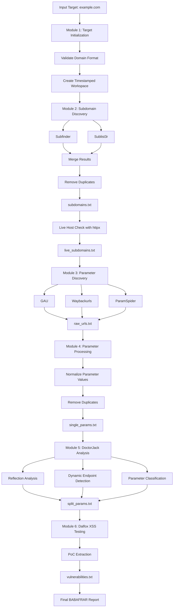
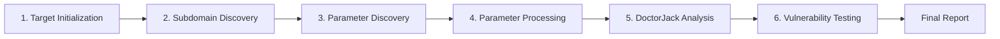
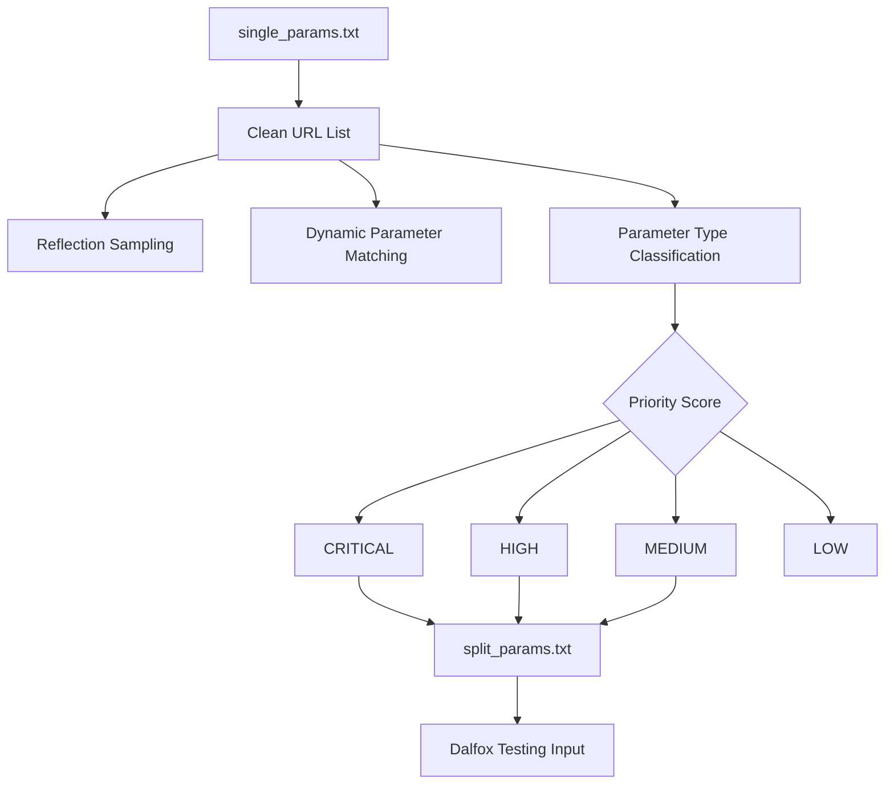

# BABAFRAR

> Automated XSS recon, parameter discovery, prioritization, and Dalfox-based testing framework for authorized security assessments.


---

## ⚠️ Responsible Use

BABAFRAR is intended only for ethical hacking, bug bounty programs, internal security testing, and authorized penetration testing. Do not scan domains, systems, or applications without explicit permission. You are responsible for following all laws, program rules, and rate limits.

---

## Overview

BABAFRAR is a Bash-based XSS hunting framework that automates the full recon-to-testing workflow:

1. Target validation and workspace creation
2. Subdomain discovery
3. Historical URL and parameter collection
4. Parameter normalization and deduplication
5. DoctorJack parameter analysis and prioritization
6. Dalfox-based XSS testing
7. Final report generation

The framework is designed to reduce noisy URL collections into a focused testing list, especially through the `split_params.txt` file generated during the DoctorJack analysis stage.

---

## Main Workflow



---

## Module Flow



---

## DoctorJack Analysis Flow



---

## Features

- Domain validation before scan execution
- Timestamped result workspaces
- Subdomain discovery with Subfinder and Sublist3r
- Live host filtering with httpx
- Historical URL collection using GAU and Waybackurls
- ParamSpider integration for parameter discovery
- Parameter normalization with qsreplace fallback support
- Parameter frequency analysis
- DoctorJack classification for high-value parameters
- Prioritized testing input through `split_params.txt`
- Dalfox file, pipe, and targeted scan modes
- Dalfox PoC block extraction
- Final human-readable report
- Run statistics stored in logs

---

## Toolchain

BABAFRAR uses the following tools:

| Tool | Purpose |
|---|---|
| Subfinder | Passive subdomain discovery |
| Sublist3r | Subdomain discovery |
| httpx | Live host and reachable URL filtering |
| GAU | Historical URL discovery |
| Waybackurls | Archive URL discovery |
| ParamSpider | Parameter discovery from historical sources |
| qsreplace | Parameter value normalization |
| Dalfox | XSS scanning and PoC generation |

---

## Installation

### 1. Clone the repository

```bash
git clone https://github.com/YOUR_USERNAME/BABAFRAR.git
cd BABAFRAR
```

### 2. Make the script executable

```bash
chmod +x babafrar.sh
```

### 3. Run a scan

```bash
./babafrar.sh example.com
```

BABAFRAR can attempt to install missing tools automatically when prompted.

---

## Recommended Manual Dependency Installation

For Kali Linux or Debian-based systems:

```bash
sudo apt update
sudo apt install -y git curl wget python3 python3-pip golang-go
```

Install Go-based tools:

```bash
go install github.com/projectdiscovery/subfinder/v2/cmd/subfinder@latest
go install github.com/projectdiscovery/httpx/cmd/httpx@latest
go install github.com/tomnomnom/anew@latest
go install github.com/tomnomnom/qsreplace@latest
go install github.com/hahwul/dalfox/v2@latest
go install github.com/lc/gau/v2/cmd/gau@latest
go install github.com/tomnomnom/waybackurls@latest
```

Install Python-based tools:

```bash
pip3 install --user sublist3r uro
mkdir -p ~/tools
git clone https://github.com/devanshbatham/ParamSpider.git ~/tools/ParamSpider
pip3 install --user -r ~/tools/ParamSpider/requirements.txt
```

Add Go and local Python binaries to PATH:

```bash
echo 'export PATH="$HOME/go/bin:$HOME/.local/bin:$PATH"' >> ~/.bashrc
source ~/.bashrc
```

For Zsh:

```bash
echo 'export PATH="$HOME/go/bin:$HOME/.local/bin:$PATH"' >> ~/.zshrc
source ~/.zshrc
```

---

## Usage

```bash
./babafrar.sh <target-domain>
```

Example:

```bash
./babafrar.sh example.com
```

Do not include a path or endpoint. Use a root domain such as:

```bash
example.com
```

Not:

```bash
https://example.com/login
```

---

## Output Structure

```text
babafrar_results/
└── example.com/
    ├── latest -> timestamped_run/
    └── 20260707_123456/
        ├── subdomains/
        │   ├── subfinder.txt
        │   ├── sublist3r.txt
        │   ├── subdomains.txt
        │   └── live_subdomains.txt
        ├── urls/
        │   ├── gau_urls.txt
        │   ├── wayback_urls.txt
        │   └── raw_urls.txt
        ├── parameters/
        │   ├── single_params.txt
        │   └── param_frequency.txt
        ├── analysis/
        │   ├── clean.txt
        │   ├── reflected.txt
        │   ├── dynamic_candidates.txt
        │   ├── split_params.txt
        │   ├── final_review.tsv
        │   └── report_data.json
        ├── vulnerabilities/
        │   ├── vulnerabilities.txt
        │   ├── dalfox_pocs.txt
        │   ├── dalfox_summary.txt
        │   ├── dalfox_raw_output.txt
        │   └── README.txt
        ├── logs/
        │   ├── run_info.txt
        │   ├── stats.txt
        │   └── dalfox_file.log
        └── BABAFRAR_REPORT.txt
```

---

## Important Files

| File | Description |
|---|---|
| `subdomains/subdomains.txt` | Unique discovered subdomains |
| `subdomains/live_subdomains.txt` | Live subdomains detected by httpx |
| `urls/raw_urls.txt` | URLs containing parameters |
| `parameters/single_params.txt` | Normalized unique parameter endpoints |
| `analysis/final_review.tsv` | Classified parameters with priority |
| `analysis/split_params.txt` | Prioritized Dalfox testing input |
| `vulnerabilities/dalfox_pocs.txt` | Extracted Dalfox PoC blocks |
| `vulnerabilities/vulnerabilities.txt` | Main vulnerability output |
| `BABAFRAR_REPORT.txt` | Final scan report |

---

## Example Parameter Normalization

Before:

```text
https://test.com/search?q=test
https://test.com/id.php?id=5
https://test.com/id.php?id=100
https://test.com/page?cat=1
```

After:

```text
https://test.com/search?q=123
https://test.com/id.php?id=123
https://test.com/page?cat=123
```

This reduces duplicate testing and helps Dalfox focus on unique parameter endpoints.

---

## Dalfox Testing Modes

During Module 6, BABAFRAR provides three testing options:

| Option | Mode | Input |
|---|---|---|
| 1 | Dalfox file scan | `parameters/dalfox_reachable_params.txt` |
| 2 | Pipe all URLs | `urls/raw_urls.txt` |
| 3 | Targeted parameters | `analysis/split_params.txt` |

Recommended option: `1` for general scans, or `3` when you want faster prioritized testing.

---

## Security Notes

- Always test only authorized targets.
- Verify every Dalfox finding manually before reporting.
- Do not commit scan results, logs, private targets, API keys, cookies, or tokens.
- Keep `babafrar_results/` ignored in Git.
- Respect bug bounty program scope and rate limits.

---

## Recommended `.gitignore`

```gitignore
# BABAFRAR generated output
babafrar_results/
results/
logs/
*.log
*.tmp
*.bak

# Secrets / local config
.env
*.env
config.local
cookies.txt
headers.txt

# OS / editor files
.DS_Store
Thumbs.db
.vscode/
.idea/
```

---

## Suggested Repository Structure

```text
BABAFRAR/
├── babafrar.sh
├── README.md
├── LICENSE
└── .gitignore
```

---

## Roadmap

- Add non-interactive CLI flags
- Add JSON and Markdown report export
- Add install script
- Add Docker support
- Add GitHub Actions shellcheck workflow
- Add resume mode for interrupted scans
- Add rate-limit configuration
- Add custom Dalfox payload support

---

## Disclaimer

This project is provided for educational and authorized security testing purposes only. The author is not responsible for misuse, unauthorized scanning, data loss, service disruption, or legal consequences caused by this tool.
